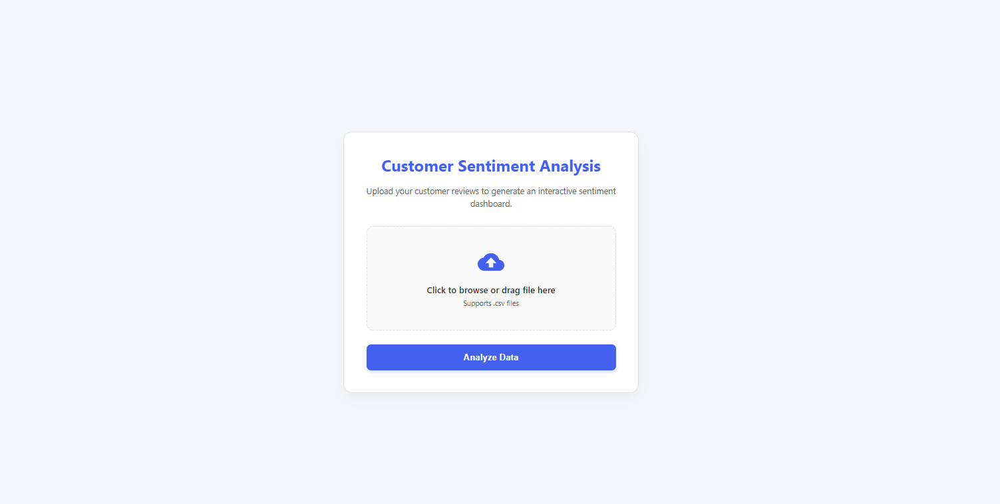
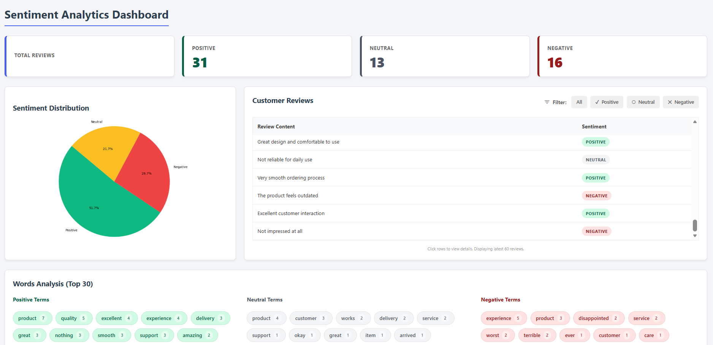

# 📊 Customer Sentiment Analysis Web Application (Flask) 🧠📈  

A **Customer Sentiment Analysis Web Application (Flask)** that accepts customer reviews via CSV upload, analyzes sentiment using traditional Natural Language Processing techniques, and presents clear insights through **charts, metrics, and filters**.  

This project focuses on **interpretable sentiment analysis** using **NLTK** and **TextBlob**, strictly avoiding deep learning models — making it **lightweight, fast, and easy to understand**.  

---

## 🧩 What is this Flask Web Application?  

This application allows businesses or analysts to understand **customer feedback at scale** by:  

- 📂 Uploading customer reviews in CSV format  
- 🧠 Automatically classifying each review as Positive, Neutral, or Negative  
- 📊 Displaying insights through a dashboard with charts and word analysis  
- 🔍 Allowing users to filter reviews by sentiment and view individual review details  

**Backend:** Flask  
**Frontend:** HTML, CSS, Jinja templates for dynamic rendering  

---

## 🖼️ Application Screenshots  

### 🔹 Frontend — CSV Upload Page  
  

### 🔹 Dashboard — Sentiment Insights  
  

---

## 🚀 Why Use This Application?  

### 🔹 Problem with Manual Review Analysis  
- ⏱️ Time-consuming to read thousands of reviews  
- ❓ Difficult to identify overall customer sentiment  
- 📉 No clear visualization of feedback trends  

### 🔹 How This Application Helps  
- 🧠 Automatically understands sentiment  
- 📊 Visualizes feedback trends clearly  
- 🔍 Highlights frequently used positive & negative words  
- ⚡ Fast, lightweight, and easy to deploy  

---

## ✨ Key Features  

- 📂 **CSV Upload** — Upload customer reviews easily  
- 😊 **Sentiment Classification** — Positive / Neutral / Negative  
- 📊 **Sentiment Distribution Chart** — Visual summary of feedback  
- 🔤 **Most Common Positive Words** — Identifies strengths  
- ⚠️ **Most Common Negative Words** — Highlights issues  
- 🔍 **Filter by Sentiment** — View reviews category-wise  
- 📝 **Individual Review View** — Detailed sentiment & polarity

---

## 🧑‍💻 Tech Stack  

- 🐍 **Python**  
- 🌐 **Flask (Backend Framework)**  
- 🎨 **HTML, CSS, Jinja2**  
- 🧠 **NLTK & TextBlob (Text Processing)**  
- 📊 **Chart.js (Data Visualization)**  
- 📁 **Pandas (CSV Handling)**  

---

## 🧪 Sentiment Classification Logic  

Sentiment is calculated using **TextBlob polarity score**  

**Classification rules:**  
- 😊 Positive → polarity > 0.1  
- 😐 Neutral → polarity between -0.1 and 0.1  
- 😠 Negative → polarity < -0.1  

---

## 🏗️ Project Structure  

```
sentiment-analysis-flask/
│
├── app.py                     
├── requirements.txt           
├── README.md                  
│
├── data/
│   └── sample_reviews.csv    
│
├── images/
│   ├── dashboard.png          
│   └── frontpage.png          
│
├── static/
│   └── sentiment_chart.png    
│
├── templates/
│   ├── index.html             
│   └── dashboard.html         
│
├── utils/
│   ├── __pycache__/           
│   ├── sentiment.py           
│   └── text_processing.py     


---

## ⚙️ Installation & Setup  

### 🔹 Step 1: Clone Repository  
```bash
git clone https://github.com/your-username/sentiment-analysis-flask.git
cd sentiment-analysis-flask
```

### 🔹 Step 2: Create Virtual Environment  
```bash
python -m venv venv
venv\Scripts\activate   # Windows
```

### 🔹 Step 3: Install Required Libraries  
```bash
pip install flask pandas nltk textblob matplotlib
```

Or using **requirements.txt**:  
```bash
pip install -r requirements.txt
```

### 🔹 Step 4: Download NLTK Resources  
```python
import nltk
nltk.download('punkt')
nltk.download('stopwords')
```

### 🔹 Step 5: Run the Flask Application  
```bash
python app.py
```

### 🔹 Step 6: Open in Browser  
```
http://127.0.0.1:5000/
```

---

## 📥 Sample CSV Input Format  

```csv
review_id,review_text
1,The product quality is amazing and delivery was fast
2,Customer support was okay not great
3,Very disappointed with the service
4,Excellent experience will buy again
5,Worst product ever
```
